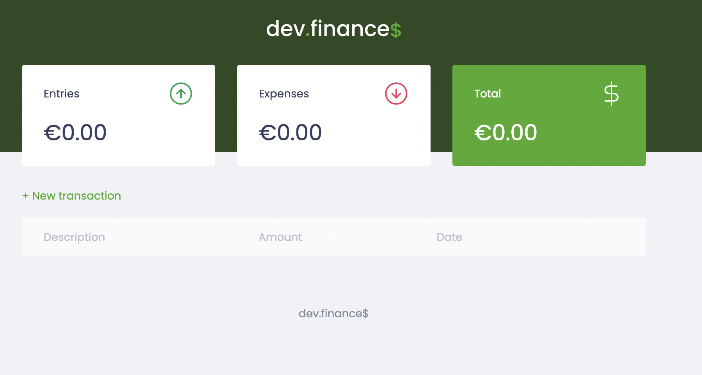
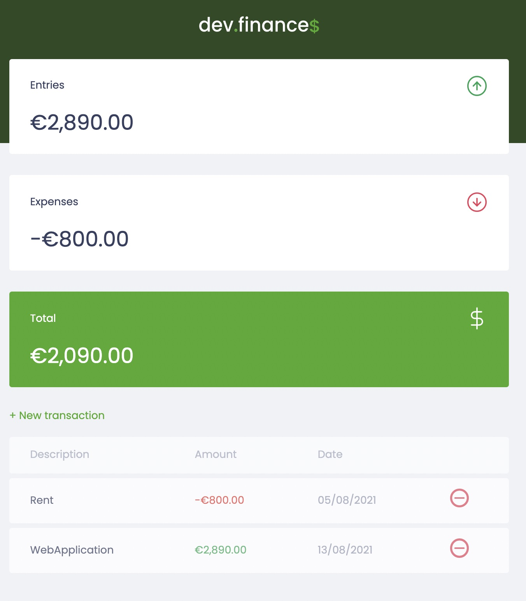
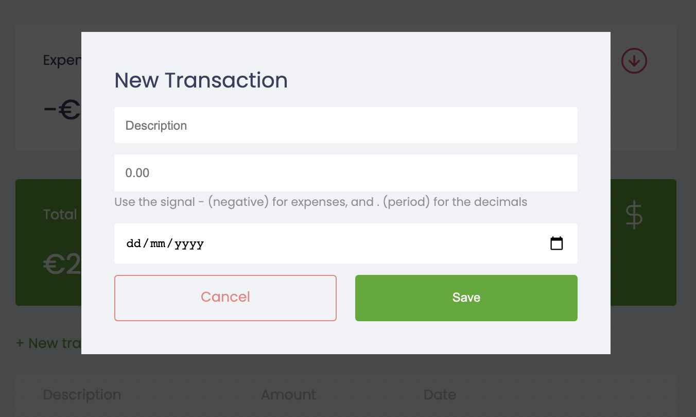

<h1 align="center"></h1>

Webpage to control personal finances developed during a Bootcamp to practice HTML, CSS and JavaScript offered by Rocket Seat

<h3>:closed_book: About</h3>

The webpage allows the user to see his/her current balance, the total incomes and the total expenses.

The page also shows a table that includes all the transactions. The user can add a transaction or remove it.

When there is a change in the table transactions the totals in the top of the page are also updated.

The page starts with no transactions and while they are added they are saved in the browser storage using JSON

<h3>:computer: Layout</h3>

It is a responsive layout that adapts to small and big screens.

The smaller screens have the total balances in rows and in big screens the amounts are showed in a 3 column-grid.

For the table, if the screen is too small, the user can scroll the screen to see all the data and it will not affect the size and display of the other elements.

To add a new transaction a modal window is displayed above the page and the user can add new incomes or expenses

<h3>:sunrise: Technologies Used</h3>

The project was developed using the following technologies:

<code></code>
<code></code>
<code></code>

